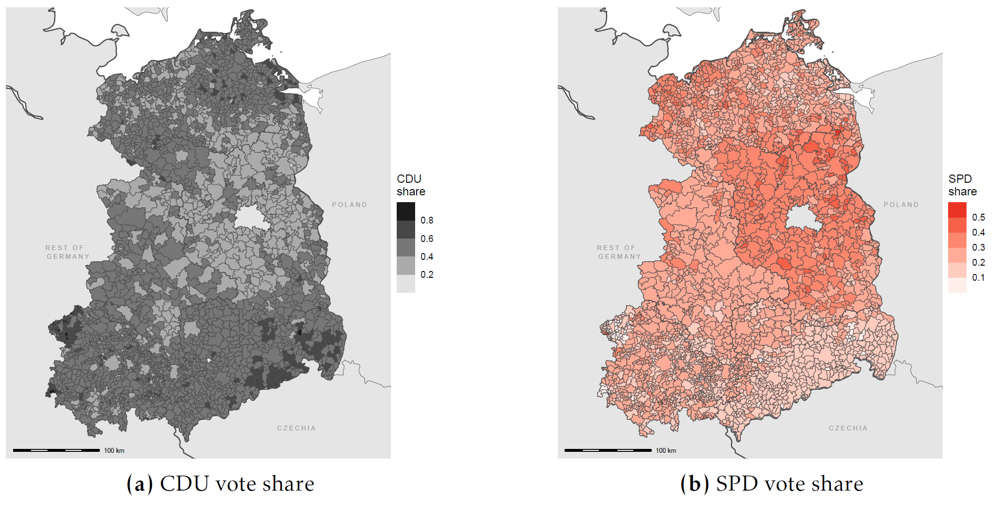
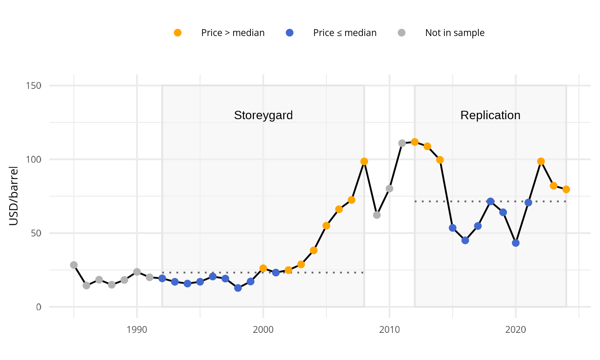
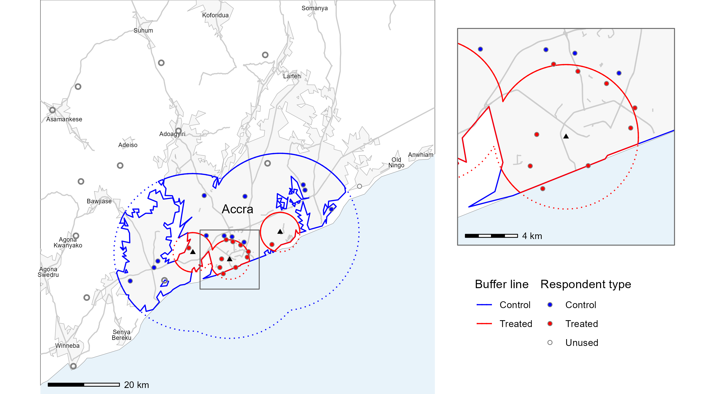
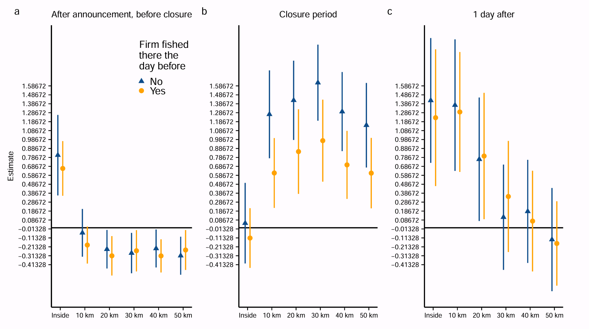
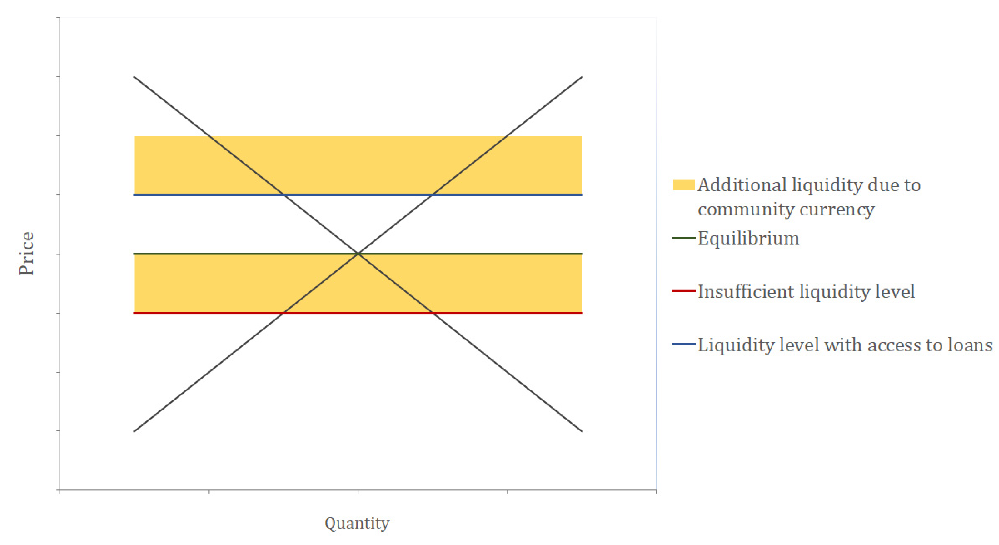

# Working papers

## Cloudy with a Chance of Laziness

**Long-Lasting Effects on Voting from the First Federal Election in Eastern Germany** with Valentin Lindlacher

We investigate the long-run effects of early democratic participation on subsequent voting behavior, focusing on Eastern Germany’s first federal election after reunification in 1990. With a weather IV, we find that first-time electoral choices affect party support in the long term. A higher municipal vote share for the quasi-incumbent party CDU in the initial election in 1990, caused by weather conditions, leads to systematically higher CDU vote shares in subsequent elections. Unlike studies of established democracies, our setting rules out path dependence, since this was the first Bundestag election for the entire East German electorate. This suggests that early election choices can set individuals on a path of sustained party support, consistent with theories of habit formation and the accumulation of expressive benefits from voting. The findings underscore the formative power of early democratic experiences: Context-specific shocks can leave lasting imprints on political behavior, particularly in societies undergoing institutional transformation.

# Work in progress

## Ethnic Dimensions of Trade

**The Impact of Oil Prices on Sub-Saharan African Development** with Ronja Huhn, Christian Leßmann, and Kyra Riederer

This paper investigates the economic effects of Oil Prices on development in Sub-Saharan Africa (SSA), focusing on the ethnic dimension of these effects. Despite extensive research on the relationship between trade, transport costs, and economic growth, there is limited understanding of how ethnic boundaries influence the distribution of trade benefits. Our key research question is: Do ethnic boundaries create economic discontinuities that hinder the diffusion of economic benefits? We contribute to the literature by extending the work of @farther, who demonstrated that transport costs significantly shape urban economic growth, particularly in proximity to ports. While Storeygard focused on spatial variation in transport costs driven by oil price fluctuations, our study incorporates ethnic boundaries into the analysis to assess whether economic gains from trade are unevenly distributed among ethnic groups. This extension addresses the broader issue of spatial inequality, emphasizing the role of historical ethnic fragmentation in amplifying economic disparities.

## When Waste Becomes Wealth

**The Spillover of China’s Waste Ban to African Landfills** with Christian Leßmann

Rapid urbanization in Sub-Saharan Africa has expanded both the population and the volume of waste, much of which ends up in landfills. These sites simultaneously provide rare income opportunities for the urban poor and expose nearby residents to health risks. We causally study how landfills affect local development in terms of wealth and health by exploiting China’s 2018 \textit{Operation National Sword}, which banned the import of 24 waste categories. The resulting redirection of waste exports increased the value of landfills in African port cities but left hinterland cities unaffected. Using a triple-difference design and novel hand-collected data on landfills in Ghana and Kenya, linked to DHS microdata, we show that landfill-value increases improve household wealth, moving households up the national wealth distribution, and raise access to antenatal care. We find no detectable effect on child health. Our results highlight the dual role of landfills as extractive sites: they increase wealth and improve access to health services through informal recycling markets, yet they do not mitigate underlying health hazards.

# Publications

## A Comment on "Information and Spillovers from Targeting Policy in Peru's Anchoveta Fishery"

with Marta Bernardi and Rebecca Rotich (2024, [I4R Discussion Paper Series No. 156](https://www.econstor.eu/handle/10419/302900))

The study provides empirical evidence that a targeted policy can backfire because information signals affect non-targeted units. Specifically, the analysis of the policy aimed at regulating the harvesting of juvenile fish in Peru's Anchovy Fishery, by temporarily closing areas with high juvenile catch percentages, reveals an unintended increase of 48% in the overall seasonal juvenile catch percentage. This appears to be due to substantial spatial and temporal spillovers generated by the policy that reduces search costs for fishers. The study combines administrative micro-data used by the regulator to generate closures with biologically richer data from fishing firms. All results are easily computationally reproducible within a 5-hour time frame, except for the synthetic controls robustness check, which takes a considerable amount of time (appr. 64 hours) but works. We stress the robustness and reproducibility of the study by testing whether the analysis is robust to the use of different types of standard errors, and the findings appear unaffected. Overall, the full analysis and graphic outputs of the paper are reproducible using the publicly available complementary data and code from the AEJ website despite minor code interpretability challenges.

## Economic Advantages of Community Currencies
(2020, [**Journal of Risk and Financial Management**](https://www.mdpi.com/1911-8074/13/11/271))

Community currencies are only sometimes economically advantageous.
We focus on seasonal changes in money 
upply and assume that community currencies stabilize the money supply in a local community.
This leads to additional transactions during seasons of insufficient supply of national currency.
We hypothesize community currencies are therefore economically advantageous in a surrounding of seasonally insufficient money supply.
We test the hypothesis qualitatively with two case studies, the German Chiemgauer and the Kenyan Sarafu Credit.
We find community currencies are only economically advantageous in an environment of insufficient liquidity.
